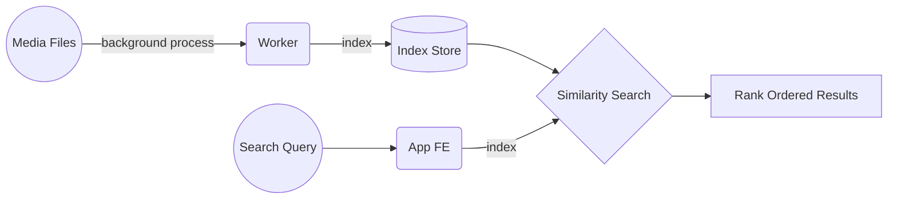

Contributing Guidelines
---

Finding Issues that Need Help
--- 

If you're new to the project and want to help, but don't know where to start, we have a semi-curated list of issues that should not need deep knowledge of the system.
[Have a look and see if anything sounds interesting]()

Setting Up Dev Environment
---

## Components


---


## Priority Notes

This project consists of two almost parallel tracks: `research` and `software`. Research priority is to experiment and get the features working in a notebook, while `software` productionizes it. All tasks below are in decreasing order of priority.

### Software
1. To run using docker compose
2. Worker to index images in the background
3. Decide and use appropriate similarity search engine
4. FE app to view images
5. Advanced Search
6. Tag pictures

### Research
1. Get more model outputs (can we augment `CLIP` with object detection and `GLOVE` embeddings?)
2. Detect faces
3. Personalised search (tag friends; search by names)
4. Negative search ("photos with A and without B")
5. Video search (smart sampling frames)

---


### Local Setup for Development
```
# This repo needs pytorch to be installed
# Hopefully you're using pipenv / virtualenv / anaconda
# so that you don't mess up your package versions
pip install -r requirements.txt

# Running
# 1. Running the ML server
cd ml && python server.py --index-loc ../data/

# 2. Running the notebook
cd nbs && jupyter notebook

# 3. Running the Indexer
#TODO
```


Support Channels
--- 
Whether you are a user or contributor, official support channels include:
- Github Issues: [https://github.com/thebayesianconspiracy/scanpix/issues](https://github.com/thebayesianconspiracy/scanpix/issues)
- Discord: `#scanpix` in [The Bayesian Conspiracy Discord](https://discord.gg/RD5RYvNw)

Before opening a new issue or submitting a new pull request, it's helpful to search the project - it's likely that another user has already reported the issue you're facing, or it's a known issue that we're already aware of.