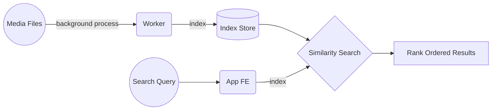

# scanpix

scanpix is a `local Google Photos`. It allows you to search local images and videos using text. I love the features of Google Photos, but don't like that I have to send them all my pictures, and that I'm at their mercy for new features.

## Ultimate goal
- Link your local file storage or Dropbox/Drive 
- Create indexes for images/videos in the background
- App to search for images/videos using text
- Extend to a general `metadata(file)` -> `semantic search` paradigm

## Components


---
## Contribution / Priority Notes

This project consists of two almost parallel tracks: `research` and `software`. Research priority is to experiment and get the features working in a notebook, while `software` productionizes it. All tasks below are in decreasing order of priority.

### Software
1. To run using docker compose
2. Worker to index images in the background
3. Decide and use appropriate similarity search engine
4. FE app to view images
5. Advanced Search
6. Tag pictures

### Research
1. Get more model outputs (can we augment `CLIP` with object detection and `GLOVE` embeddings?)
2. Detect faces
3. Personalised search (tag friends; search by names)
4. Negative search ("photos with A and without B")
5. Video search (smart sampling frames)

---
# Usage (ToDo: Add better instructions!)
- It also needs electron installed for the app

```
# Installation
# 1. Backend
# This repo needs pytorch to be installed
# Hopefully you're using pipenv / virtualenv / anaconda
# so that you don't mess up your package versions
pip install -r requirements.txt

# 2. Frontend app (you can skip this if you're just running the nbs and server)
# cd app && yarn install
-------------------------------------------------------------------------

# Running
# 1. Running the ML server
cd ml && python server.py --index-loc ../data/
# This should start up the ml server
# It takes a while the first time you run it

# 2. Running the notebook
cd nbs && jupyter notebook

# 3. Running the app
cd app && yarn start
```


---
## Questions to think about
- Do we ever learn from multiple users? How do we get feedback on performance/quality? User generated? Self generated?
- How do we push new models?